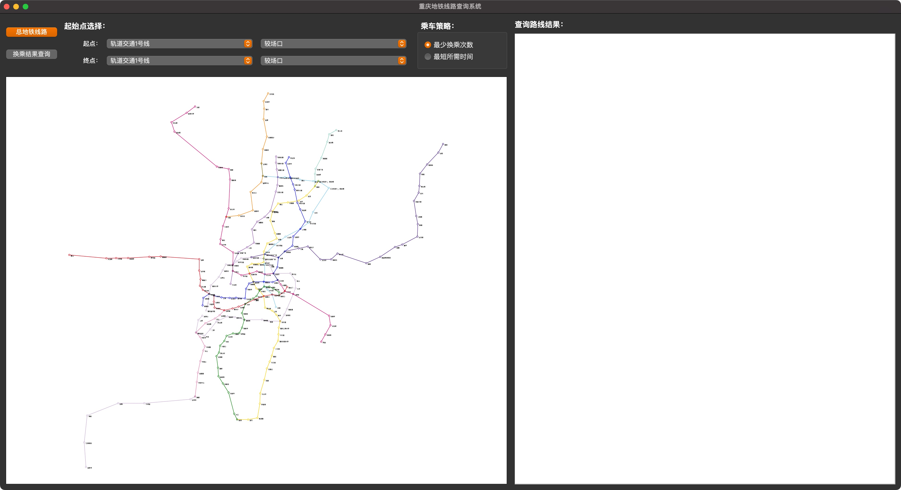
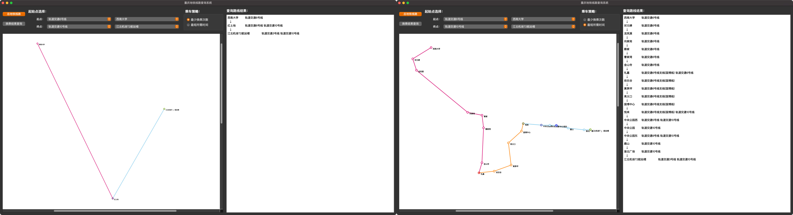

# Subway route finder

This system, developed using the Qt framework, offers a convenient and fast Chongqing subway route query function. It empowers users to effortlessly access subway lines, station information, and obtain optimal route planning.

# Program functionality

To achieve efficient data management and query functionality, we have selected appropriate data structures and algorithms such as graph representation and traversal, shortest path algorithms, and more.

# Build

1. Clone the repository using Git.
2. Open the subway.app project file in Qt (The project is developed using Qt version 6.5.1).
3. Simply click on the "Build" button to generate the application on your system.
